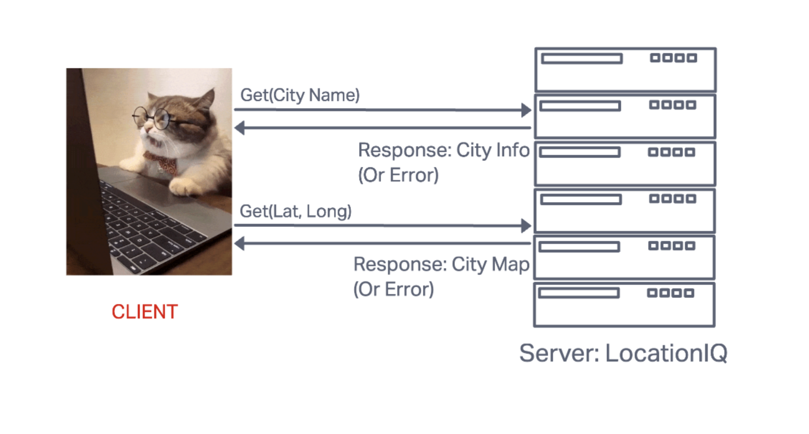
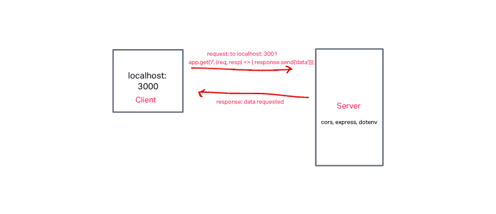
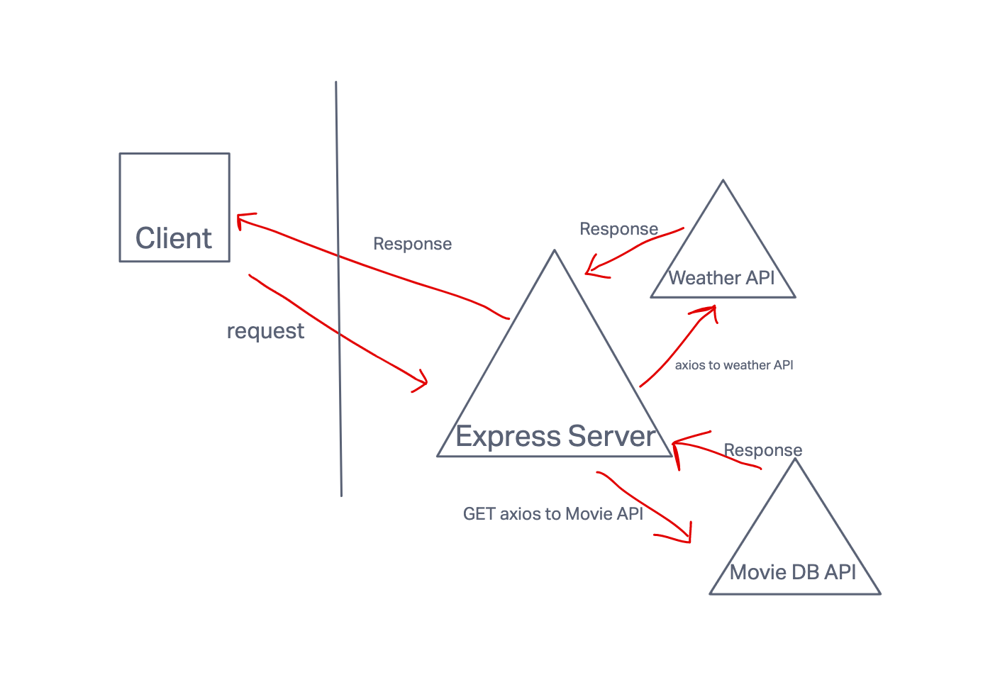

# City Explorer

**Author**: Katharine Swilley
**Version**: 1.0.0

## Overview

## Getting Started

## Architecture

## Change Log

## Credit and Collaboration

* Ben Small on the wireframe.
* Sam Brindle helped with conditional map rendering

;
;

## Time Estimates:

### **Lab 6 -Task 1: Set up React repo and API keys**

Estimate of time needed to complete: 30 minutes

Start time: 2:15pm

Finish time: 3:15pm

Actual time needed to complete: 1 hour

### **Lab 6 - Task 2: Locations**

Estimate of time needed to complete: 1.5 hrs

Start time: 3:30pm

Finish time: 4:40pm

Actual time needed to complete: 1 hour 10 minutes

### **Lab 6 - Task 3: Map**

Estimate of time needed to complete: 1 hour

Start time: 4:45 pm

Finish time: 5:45 pm

Actual time needed to complete: 1 hour with CSS left to finesse

### **Lab 6 - Task 4: Errors**

Estimate of time needed to complete: 30 minutes

Start time: 5:45 pm

Finish time: 6:00 pm

Actual time needed to complete: 15 minutes
